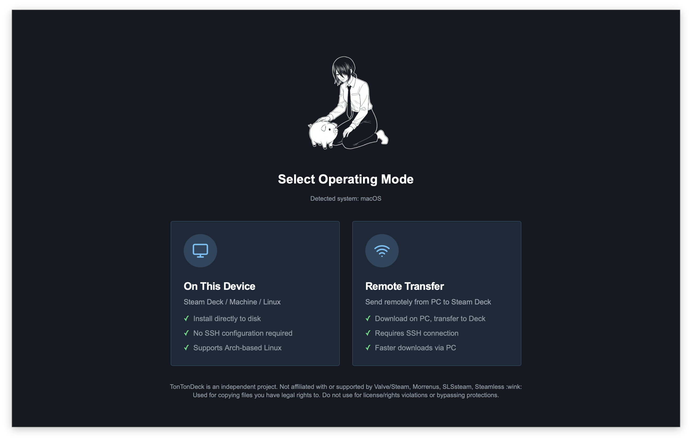

# BoilerRoom

> **⚠️ WORK IN PROGRESS** - Pre-release! Use at your own risk.

Steam Deck Game Manager - Manage and sync your Steam library on Steam Deck/Linux.



---

## Quick Install

**One-liner:**
```bash
curl -H 'Accept: application/vnd.github.v3.raw' -fsSL https://api.github.com/repos/uxandai/boilerroom/contents/install.sh?ref=main | bash
```
> **⚠️ Security Warning:** Never pipe a script to bash without reading it first! You can view the code [here](https://github.com/uxandai/boilerroom/blob/main/install.sh).

**Or manually:**
```bash
git clone https://github.com/uxandai/boilerroom.git
cd boilerroom
./install.sh
```

The installer will:
1. Download BoilerRoom AppImage
2. Install and configure SLSsteam
3. Patch Steam for Gaming Mode support

**After installation:** Restart Steam, then launch BoilerRoom.

---

## Features

- 🔍 **Game Search** - Search and browse games
- 📦 **One-Click Install** - Download and configure games for your Deck
- ⚙️ **SLSsteam Integration** - Games appear in Gaming Mode
- 📋 **Activity Logs** - Track all operations
- 🎮 **Library Management** - List, uninstall, manage games
- 🖼️ **SteamGridDB Artwork** - Fetch game artwork

---

## Operating Modes

### Local Mode (Running on Steam Deck)
- Downloads directly to Steam library
- No file transfer needed

### Remote Mode (PC → Steam Deck)
- Downloads to PC, transfers via rsync/SSH
- Requires: SSH enabled on Deck, `sshpass` on PC

---

## Requirements

| Tool | Purpose | Required |
|------|---------|----------|
| **DepotDownloaderMod** | Downloads game files | ✅ Yes |

> Configure paths in **Settings → Paths and Tools**

---

## Troubleshooting

**SLSsteam install didn't work?**

Use [headcrab.sh](https://github.com/Deadboy666/h3adcr-b):
```bash
curl -fsSL "https://raw.githubusercontent.com/Deadboy666/h3adcr-b/refs/heads/main/headcrab.sh" | bash
```

---

## Configuration

**Location:** `~/.local/share/com.boilerroom.app/settings.json`

```json
{
  "connectionMode": "local",
  "api_key": "your-api-key",
  "depot_downloader_path": "/path/to/DepotDownloaderMod"
}
```

---

## Development

### Prerequisites
- **Node.js** 18+
- **Rust** ([rustup.rs](https://rustup.rs/))
- **Tauri CLI**: `cargo install tauri-cli`

### Build

**Dependencies for AppImage:**
- `appimagetool` (from AUR or GitHub)
- `fuse2` or `libfuse2`

```bash
cd source
npm install

# Option 1: Development Mode
npm run tauri dev

# Option 2: Build Binary Only (Fast, no bundler)
npm run tauri build -- --no-bundle

# Option 3: Build AppImage (Bundles webkit2gtk & deps)
npm run tauri build -- --bundles appimage
```

---

## Credits

- **[AceSLS](https://github.com/AceSLS)** - [SLSsteam](https://github.com/AceSLS/SLSsteam)
- **[DepotDownloaderMod](https://github.com/SteamAutoCracks/DepotDownloaderMod)**
- **[Deadboy666/h3adcr-b](https://github.com/Deadboy666/h3adcr-b)**

---

## License

This project is for educational purposes. Use responsibly.
